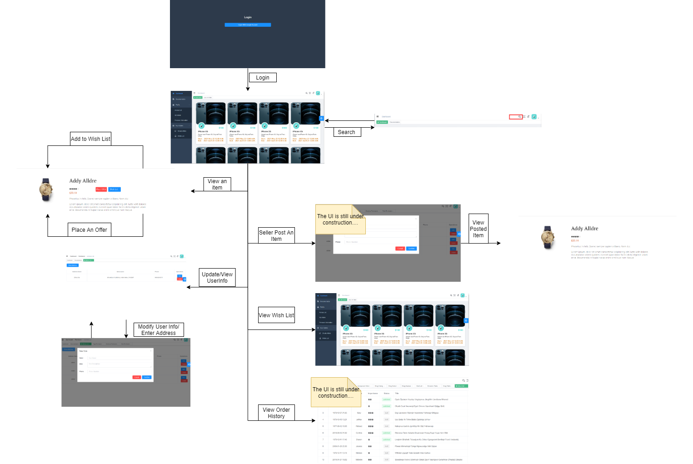

# AlwaysWin!

 

 

# Preface
Alwayswin project is committed to creating a complete bidding e-commerce system, using the current popular technology to achieve.

## Project Introduction
AlwaysWin! auction platform offer small businesses a complete array of online bidding solutions to fit any budget, it is promising   in helping individual customers and small businesses.

##Project Demo

front-end address: null

##Dashboard

##User Dashboard

##Bidding Page

## UI design

## Tech stack

#Backend
SpringBoot: https://spring.io/projects/spring-boot

MyBatis:http: //www.mybatis.org/mybatis-3/zh/index.html

PageHelper: http://git.oschina.net/free/Mybatis_PageHelper

#Frontend
Vue: https://vuejs.org/

Element UI: https://element.eleme.io

#Develop tool
IDEA: 	https://www.jetbrains.com/idea/download

X-shell: http://www.netsarang.com/download/software.html

Navicat: http://www.formysql.com/xiazai.html

Postman: https://www.postman.com/

WinSCP:

Putty: 
### Enable AWS S3
Put `access-id` and `access-key` under `~/.aws/credentials`.   
`access-id` and `access-key` can be found at vocareum -> workbench -> account details. The `access-id` and `access-key` expires 
after 3 hours.  
Make sure the bucket has the policy that allows public access to every object in this
bucket.

#Set up steps
clone address: https://github.com/Men-Guo/alwayswin

#Change Log
##v0.9.5 
* fix bugs with product imp

# To Do List
* User grade system
* Review
* mobile App
* etc.